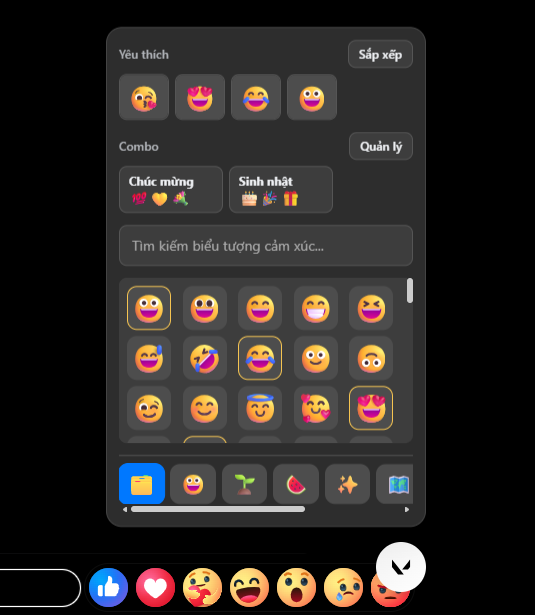
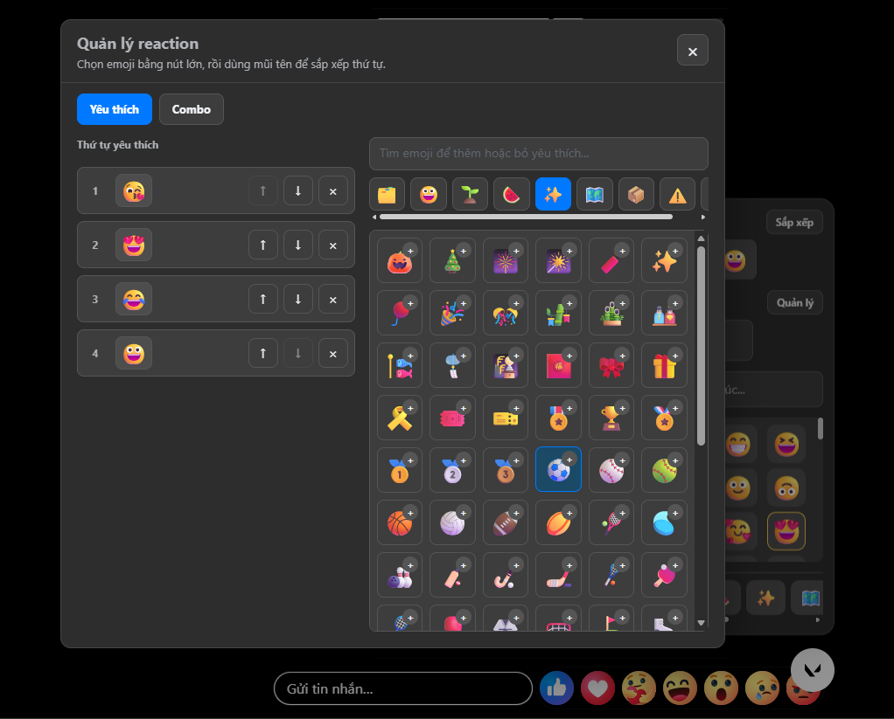
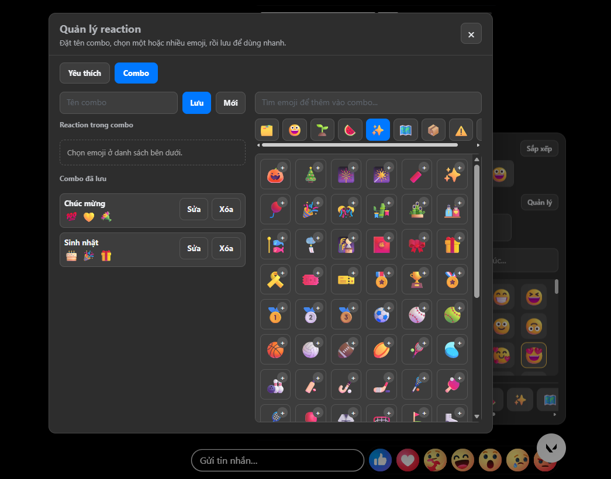

# React Story Facebook V6

Tiện ích Chrome/Edge giúp thả emoji/reaction tùy chỉnh trên Facebook Story nhanh hơn. Repo hiện tại: **[dngiang2003/react-story-facebook](https://github.com/dngiang2003/react-story-facebook)**.

Ở bản **V6 - 1.0.6**, extension có thêm danh sách reaction yêu thích, sắp xếp thứ tự, tạo combo reaction và gửi nhiều reaction theo combo.

---

## Tính Năng

- Mở popup reaction ngay trên trang Facebook Story.
- Tìm kiếm emoji theo tên hoặc ký tự.
- Lọc emoji theo nhóm: mặt & người, thiên nhiên, đồ ăn, hoạt động, địa điểm, đồ vật, ký hiệu, cờ.
- Chọn nhanh reaction yêu thích và sắp xếp lại danh sách.
- Tạo nhiều combo reaction, đặt tên từng combo và gửi lần lượt chỉ với một lần chọn.
- Hỗ trợ `www.facebook.com` và `web.facebook.com`.
- Dữ liệu emoji nằm sẵn trong extension, không cần tải từ nguồn ngoài khi sử dụng.

---

## Hình Minh Họa

### Popup cơ bản



### Cài đặt danh sách yêu thích



### Cài đặt gửi theo combo



---

## Cài Đặt

### Cách 1: Download và giải nén

1. Tải project về máy dưới dạng file `.zip`.
2. Giải nén file vừa tải.
3. Ghi nhớ thư mục đã giải nén để chọn khi load extension.

### Cách 2: Clone bằng Git

```bash
git clone https://github.com/dngiang2003/react-story-facebook.git
```

Sau đó mở thư mục project vừa clone.

### Load extension vào Chrome hoặc Edge

1. Mở `chrome://extensions/` hoặc `edge://extensions/`.
2. Bật **Developer mode** / **Chế độ nhà phát triển**.
3. Bấm **Load unpacked**.
4. Chọn đúng thư mục root của repo.
5. Mở lại Facebook hoặc bấm `F5` để tải lại trang Facebook.

---

## Cách Sử Dụng

1. Mở một link Facebook Story, ví dụ `https://www.facebook.com/stories/...`.
2. Bấm nút reaction nổi ở góc dưới bên phải.
3. Chọn emoji để gửi reaction ngay.
4. Bấm **Sắp xếp** để thêm, xóa hoặc sắp xếp danh sách yêu thích.
5. Bấm **Quản lý** trong phần combo để tạo combo mới.
6. Đặt tên combo, chọn reaction muốn gửi, rồi bấm **Lưu**.
7. Lần sau chỉ cần bấm combo đó, extension sẽ gửi lần lượt các reaction trong danh sách.

Mẹo nhỏ: nếu vừa cài hoặc vừa cập nhật extension, hãy reload extension ở trang `chrome://extensions/`, sau đó `F5` lại tab Facebook.

---

## Cấu Trúc Dự Án

```text
react-story-facebook/
├── manifest.json
├── README.md
├── LICENSE
├── CHANGELOG.md
├── CONTRIBUTING.md
├── .gitignore
├── src/
│   ├── background.js
│   ├── content.js
│   ├── story.js
│   ├── notification.js
│   └── styles.css
├── data/
│   └── emoji.json
├── assets/
│   └── icons/
└── docs/
    └── images/
```

---

## Phát Triển

Dự án là Chrome extension thuần Manifest V3, không có build step.

Các kiểm tra nhanh:

```bash
node --check src/background.js
node --check src/content.js
node --check src/story.js
node --check src/notification.js
```

Sau khi sửa code, reload extension ở `chrome://extensions/` rồi refresh tab Facebook Story.

---

## Ghi Chú Phiên Bản V6

- V6 thêm **danh sách yêu thích có thể sắp xếp**, giúp thao tác nhanh và hạn chế click nhầm.
- V6 thêm **combo reaction**, cải thiện trải nghiệm từ bản V5 của **[KimiZK-Dev](https://github.com/KimiZK-Dev/Story-Reaction)**.
- Dự án vẫn trân trọng nền tảng ban đầu từ **[whoant/react-story-facebook](https://github.com/whoant/react-story-facebook)**.

---

## Khắc Phục Sự Cố

### Không thấy nút reaction?

- Kiểm tra bạn đang ở trang Facebook Story.
- Bấm `F5` để tải lại trang Facebook.
- Vào `chrome://extensions/`, bấm reload extension rồi mở lại tab Facebook.

### Popup không cập nhật sau khi sửa code?

- Reload extension.
- Đóng tab story cũ và mở tab mới.
- Kiểm tra Console nếu vẫn có lỗi.

### Facebook thay đổi giao diện?

Facebook có thể thay đổi DOM bất cứ lúc nào. Khi đó có thể cần cập nhật selector trong `src/story.js`.

---

## Đóng Góp

Vui lòng đọc [CONTRIBUTING.md](CONTRIBUTING.md) trước khi mở issue hoặc pull request.

---

## License

Dự án phát hành theo giấy phép [MIT](LICENSE).

---

## Tác Giả Và Ghi Nhận

- Dự án hiện tại: **[dngiang2003/react-story-facebook](https://github.com/dngiang2003/react-story-facebook)**.
- Bản cải tiến V5: **[KimiZK-Dev](https://github.com/KimiZK-Dev/Story-Reaction)**.
- Bản đầu tiên / dự án gốc: **[whoant/react-story-facebook](https://github.com/whoant/react-story-facebook)**.

Cảm ơn các tác giả đầu tiên đã đặt nền móng cho extension này.
